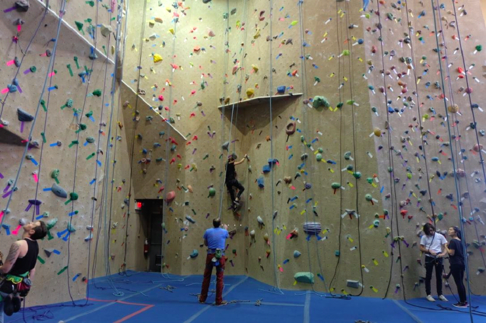
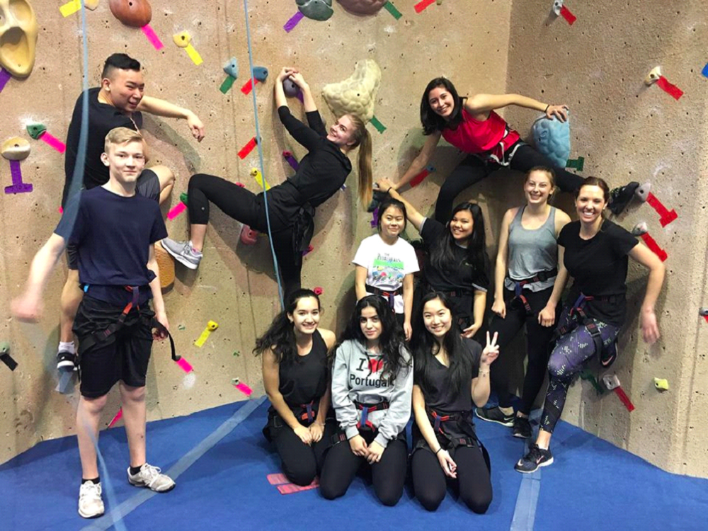
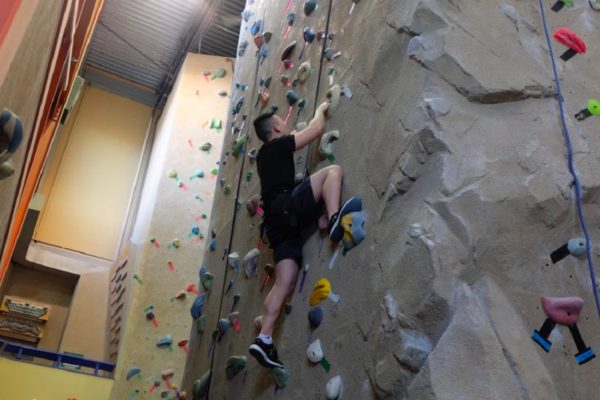

# Rock Climbing
## It rocks!

###### src: Templeton Magazine

Last month, Templeton’s Active For Life class ventured to Cliffhanger, a rock climbing gym near Science World. It’s huge, with over 8,000 square feet of climbing. It has a 40 foot ceiling and 60 foot overhang, so people are free to do as they please.

If you’re looking for something active and fun to do during the upcoming spring break, why not head out with some friends to try out rock climbing? At Cliffhanger, a day pass is $19.05. They’re open everyday from noon to 9 pm, so you can get plenty of climbing done.

<h6>src: Templeton Magazine</h6>

“Why rock climbing?” you ask. Here are some reasons:
<ul>
<li>Strengthens and tones muscles: Several muscle groups are engaged while climbing. The upper body is especially engaged because you’re pulling yourself up. Your core and legs also get a workout, because you use those to stabilize and balance yourself. We asked our Active For Life class how they were feeling the day after, and almost every one of them said their forearms have never been so sore before.</li>
<li>Mental Strength: As with most sports, rock climbing requires a lot of thinking; you have to use your problem solving abilities and quick decision making in order to make it to the top.</li>
</ul>

<ul>
<li>Conquer fears: You might find yourself within the group of people who are afraid of heights, wondering how in the world these experienced climbers climb with such grace and ease. Fear is one of the greatest obstacles in preventing us from living life to the fullest. Many of the kids in our class are scared of heights, and the great thing about rock climbing is that you can go at your own pace. For someone who is afraid of heights, reaching the top gives them a huge sense of accomplishment and boosts their confidence and self esteem.</li>
</ul>

<h6>src: Templeton Magazine</h6>

If you’re someone who doesn’t enjoy “working out” or going on runs but still wants to remain active, I definitely recommend rock climbing. Not only do you use your muscles, it’s good for your cardio and great fun.

___
Originally published by Rebecca T. at [medium.com/tssm](https://medium.com/tssm/rock-climbing-dccea12943f3#.7zdvlnq1h) on March 1, 2017
