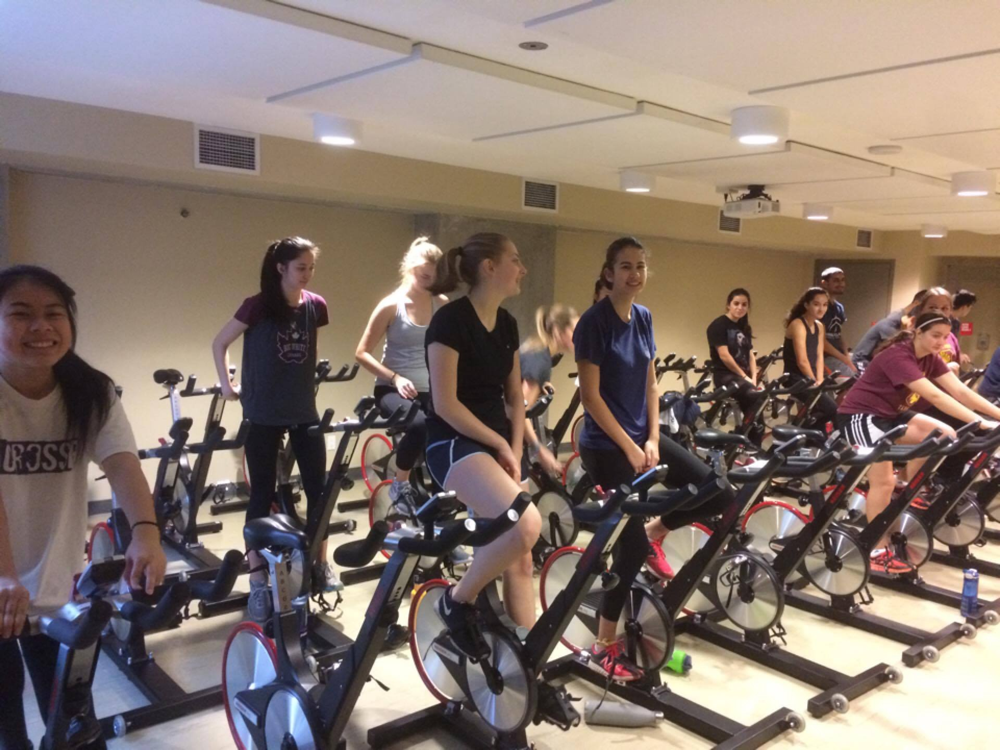

# Putting a spin on our fitness!
## Active For Life

On November 22, 2016, Templeton’s Active for Life PE class ventured downtown to the Robert Lee YMCA which is an organization that not only offers a fitness area, but also a swimming pool, childcare, two soft floor studios for yoga and pilates, and a full size gymnasium.

Our class challenged ourselves by taking a spin class that lasted for 30 minutes which left us with our legs quivering. We were sweating like crazy. Now, you might ask, “What’s so great about exercising on a stationary machine in a room with a bunch of other people?” Well, first off, you get the same benefits that you would if you were to go on a run or a bike ride outside in half the amount of time because of the intensity that you’re going at. Whether you’re a beginner or at an intermediate level of fitness, your spin instructor will challenge you by telling you to go from light resistance to heavy resistance so your legs burn and are challenged.

Here are some more benefits to High Intensity Interval Training (HIIT)
- You’ll keep burning calories for hours
- It can boost your endurance
- It can amp your VO2 max
- You’ll cut your workout in half
- Switching it up gets you similar results

Going out to a recreational centre or a gym is a great way to get in shape but it’s also a great opportunity to meet people with the same goals as you. You might even bump into a celebrity. Holly and Cecilia bumped into Richard Harmon, an actor from the TV show The 100 who plays the character Murphy. So, get out and get active!

___

Originally published at [medium.com/tssm](https://medium.com/tssm/active-for-life-fc49eef25bfe#.zi3qyd85k) on Dec 1, 2016
