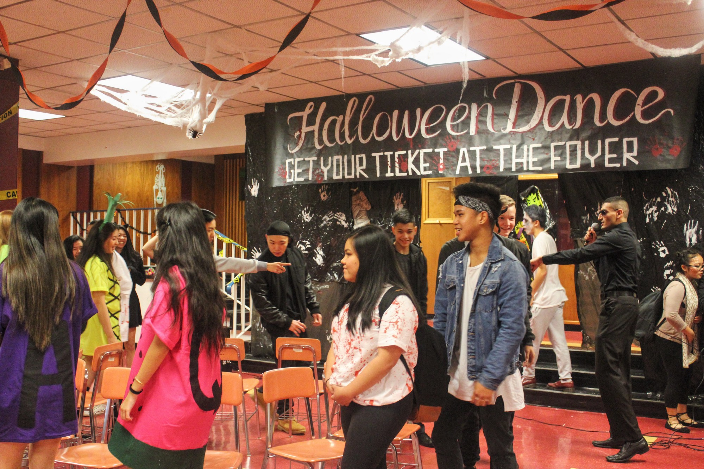
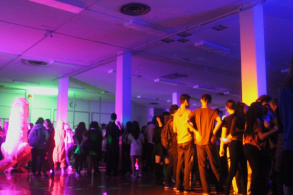

# Student Council
##  Recap (October 2016)

In October, Student Council hosted three main events; clubs day, movie night and the annual Halloween dance. Clubs day was held in the cafeteria, and there were over 15 clubs in attendance. Some of the clubs included: Games club, Environment club, and the LEO club. Clubs Day allowed clubs to promote themselves and welcome new members into their club! Movie night took place on Wednesday the 12th. The movie shown was Coraline, which was voted to be played by the Templeton students.

This year, the annual Halloween dance took place in the cafeteria last block on Halloween Day. Student Council named the dance “Monster Mashup” and the dance included a Haunted Hallway, a photobooth and free candy. Over 250 students attended the dance in the afternoon and had a blast! October was a busy but memorable month for Student Council. They had an awesome time creating events for their fellow Titans and they cannot wait for the upcoming events.

### Upcoming Events (November 2016)

In November, Student council will be hosting the Canley Cup, a Winter carnival and maybe even a cheeky free hot chocolate day! The Canley Cup is an event where high schools all over Vancouver, including Templeton, will be collecting non-perishable food items and donating them to the Vancouver Food Bank. The donation boxes will be left in English classes from November 16 to December 14 and the class that collects the most food or money will win a free pizza party! 

Templeton will be having a competition with Britannia to see who can collect the most cans so, let’s go Temp! The winter carnival, “Deck the halls”, will be taking place in the halls and the foyer on November 25th at lunch. There will be free food, activities and Christmas joy all around so don’t miss out. There will be a free hot chocolate day in November so be on the lookout for that!

___

Originally published at [medium.com/tssm](https://medium.com/tssm/student-council-1c7509a45fff#.yggf0w41t) on Nov 7, 2016.
