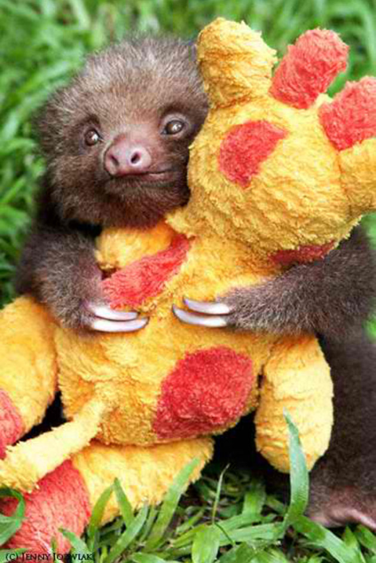

# Stuffed Animals For All Ages
## Your Monthly Smile

If you’re sleep deprived and stressing over the product of your procrastination, all you need is a relaxing moment of love and calm. Pediatricians agree that babies have everything right. They’re non-discriminatory, open-minded, more creative, carefree and they know how to properly lift things without breaking their backs. 

It seems that as we grow up, everything goes downhill. These traits fade and are associated with immaturity as we find our definite “character.” Out of all the baby superiority, one thing stands out as the most important: babies sleep with stuffed animals; faithful companions who give excellent cuddles. In the search to find a human to cuddle with, we forget about those perfectly cuddly stuffies.

A Harvard Business Review study found that the mere presence of stuffed animals improved behavior in adults, reminding them of their childhood and renewing their moral compass. Cuddling with a stuffy at night can improve your overall character, returning you to your carefree days, refuelling your childhood kindness and re-awakening your empathy to express for the rest of the day.

If everyone brought their stuffies to school on the same day, the inundation of cheer embodied through the stuffies would bring the whole school into a state of benevolence, exponentially boosting school spirit and morale. If you have any doubts about the effectiveness of this stuffed consolation, look no further than the end of the earth. For hundreds of years, stuffed animals have comforted broken hearts. 

Originally designed as pin cushions in Germany, stuffed animals have been around since the 1880s, but they looked so good that children played with them instead. Not only do people all over the world rely on stuffies, but living animals also find relief in stuffed animals. Stuffed animals can bring comfort in the harshest of times. Their soothing fur can comfort any problem and resolve any issue.

Next time you’re feeling down, you will know where to turn. By the way, IKEA has some really great stuffed animals for competitive prices.

___

Originally published by Blaine T. at [medium.com/tssm](https://medium.com/tssm/stuffed-animals-are-for-all-ages-1deb84da9063#.myh6yqgio) on Nov 7, 2016
