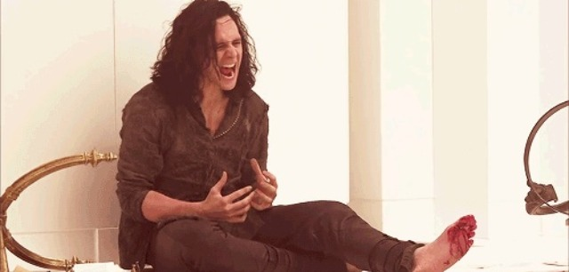

# Toe Many Problems
## My Monthly Struggle:

###### src: https://dammitdolls.com/getattachment/blog/Dammit-Dolls-Blog/January-2016/The-Mental-Process-of-Stubbing-Your-toe/thor-stubbed-toe-(1).jpg.aspx

My life is really a series of unfortunate events. A few months ago I went on vacation and when I got back, I somehow immediately slammed my foot into the coffee table that was in the center of the room. I felt like I’d been shot to be honest. Being the trooper I am, I walked it off and carried on with the rest of the evening despite being in immense pain. Fast forward to the next morning, my foot still hurt! More specifically, it was my pinky toe. It was bright red, swollen and it hurt to touch it and felt even worse when I tried to bend it. I simply thought nothing of it though and expected it to be better in the next few days. Ha I’m so stupid sometimes. It did NOT get better. I was getting off my bed and I guess I nudged it against the bed frame and I felt shooting pain throughout my foot. Looking down at my foot, I noticed that my toe was even more red than before and it was now turning purple. I couldn’t go to the doctor immediately because I had a life-guarding course that took up the whole week so I let it sit in pain.

Finally, two weeks went by and I was sitting in the doctors office. She asked to see my foot and I let her look and by her reaction, I didn’t know whether to laugh or cry. She looked at me and then at my toe and with the most blank face ever, she says “Oh, it’s broken.” What am I supposed to say to that? I just sat there super confused and got even more confused when she said “But there’s not much we can do about it so we just have to tape it until it heals.” Great, how am I supposed to explain to everyone that I broke my toe by slamming it into a table? What makes it even better is that I had a soccer game coming up in a few days. You try explaining to your team that you broke your pinky toe. I got a lot of laughs and funny looks. It generally takes about six weeks for a toe to heal but I’m irresponsible and always forget to tape it before a game or yoga so the healing process has been prolonged. It’s been a month or two since my toe broke and it’s gotten significantly better but sometimes it aches when it’s cold. Basically what I’m trying to say is, when something hurts and it’s not supposed too, go get it checked out and don’t be stupid like me.

Originally published byJasmine K. at [medium.com/tssm](https://medium.com/tssm/toe-many-problems-67c9a26875c9#.30w2rdwl2) on Nov 7, 2016
