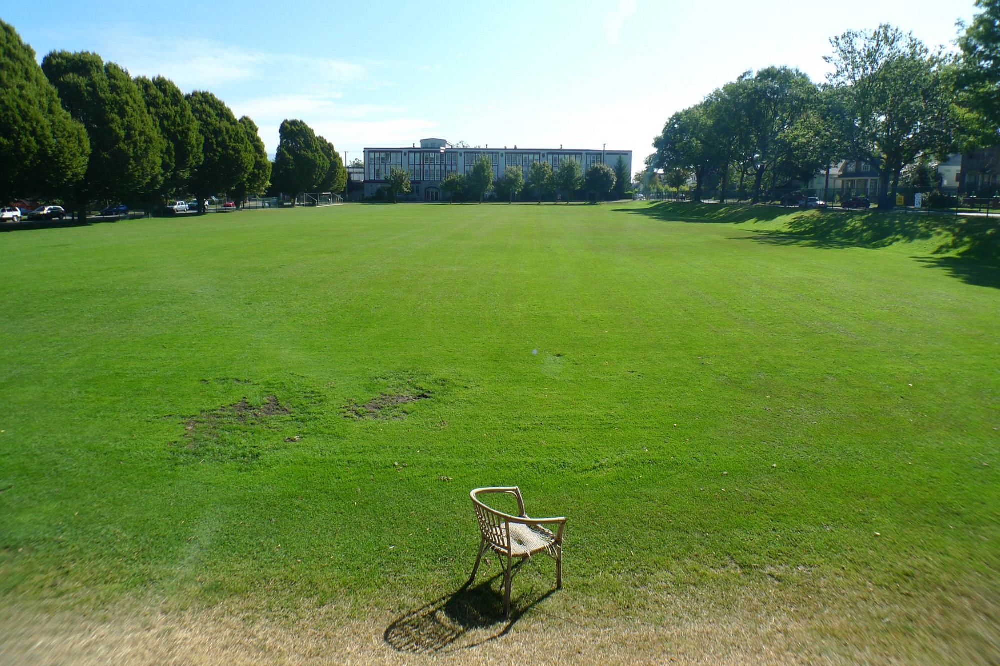

# Trying Something New

## Introducing the Templeton Secondary Student Magazine

The arrival of the New Titan Magazine is finally here! Templeton’s very own magazine! Filled with columns to help the everyday-Titan navigate school and all that comes with it. This magazine will present news columns as an outlet to catch up on monthly events, activities, and student council announcements, and to provide knowledge about Templeton clubs and sports games. We’ll also have monthly pieces of art works in the form of, comics, an art gallery, and story telling. We are open to any student or member of faculty that want their voice to be heard.

According to a small poll conducted by the magazine, 2 out of 3 people would prefer to read the magazine as a hard copy. The magazine has taken this into consideration, but for the first publication the magazine will be available only online. A decision for the second publication will be founded on the outcome of the first. The magazine urges Titans to voice their suggestions so that this can be easy and fun to read. The Templeton Secondary School Magazine team would be undoubtedly appreciative if its readers gave feedback of any sort. Whether it is about the want for a hard copy, or the idea of more news coverage on a school event, anything at all. All comments are valid and appreciated. If any Templeton students think they may want to join the TSSM team they are encouraged to contact the magazine editors Eldrich Lucero or Mateya Burney. (You can also contact us via emailing templetonmagazine@gmail.com)The TSSM team wants to be able to knit the Templeton student network closer than ever with this definitive news outlet. The team is excited to bring all aspects of this great school together and create a basic communication platform for all students.

Orginally published at [medium.com/tssm](https://medium.com/tssm/trying-something-new-bcaa02437dfc#.wj2wxjqqg) on Nov 7, 2016.
